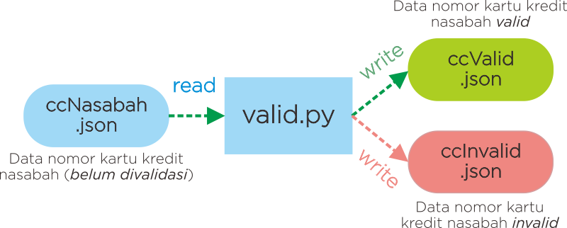
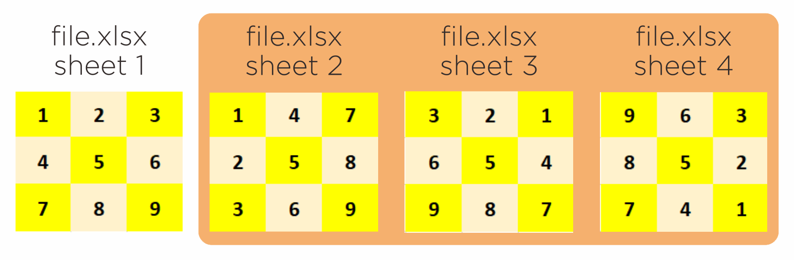

# Soal Ujian Python Data Science Fundamental


#

### **Soal 1 - 🔴🔵 Himpunan**

Diketahui:
- A = himpunan (_set_) bilangan __genap__ antara __1__ dan __20__.
- B = himpunan (_set_) bilangan __ganjil__ antara __1__ dan __20__.
- C = himpunan (_set_) bilangan __negatif__ lebih dari __-10__.
- D = himpunan (_set_) bilangan __prima__ antara __1__ dan __20__.
- E = himpunan (_set_) bilangan __komposit__ antara __1__ dan __20__.

Definisi & kategori bilangan dapat Anda simak di laman [_Wikipedia_](https://id.wikipedia.org/wiki/Bilangan). Buatlah sebuah __file python__ (_.py_) yang dapat menyelesaikan permasalahan himpunan berikut:

__a.__ A ∪ B ∪ C ∪ D ∪ E

__b.__ (A ∩ B) ∪ (D ∩ E)

__c.__ (A ∪ B) ∩ (D ∪ E)

__d.__ (A ∪ B) - (D ∪ E)

__e.__ (A ∪ B ∪ C) - (A ∩ E)

_**Catatan:**_ 

✅ Commit & push source code jawaban soal ini ke __Github__ Anda, buatlah repo dengan nama __Ujian_Himpunan__, kemudian lampirkan __url link repo Github__ Anda via email ke _lintang@purwadhika.com!_

#

### **Soal 2 - 🔺 Segitiga Kata**

Buatlah __sebuah file python__ (*.py*) yang mengandung __sebuah function__ dengan __1 parameter__, yang dapat membentuk pola segitiga dengan elemen berupa karakter-karakter dari sebuah __string__ yang menjadi parameter function tersebut. Info selengkapnya silakan ikuti case flow beserta output yang diharapkan berikut ini.

- __Case Flow__: Saat dieksekusi, program akan mencetak pola segitiga dari karakter-karakter string yang diinputkan. Jika jumlah karakter string memenuhi syarat terbentuknya pola, maka program akan menjalankannya. Namun jika jumlah karakter string tidak memenuhi syarat membentuk pola, maka akan muncul pesan bahwa string tidak memenuhi syarat membentuk pola.

    ```python
    segitigaKata('Purwadhika')
    segitigaKata('Purwadhika Startup and Coding School @BSD')
    segitigaKata('kode')
    segitigaKata('kode python')
    segitigaKata('lintang')
    ```

- __Output__ yang diharapkan:
  
    ```bash
    # segitigaKata('Purwadhika')
    P 
    u r     
    w a d   
    h i k a 
    p u r w 
    a d h   
    i k     
    a   

    # segitigaKata('Purwadhika Startup and Coding School @BSD')
    P
    u r
    w a d 
    h i k a
    S t a r t
    u p a n d C
    o d i n g S c
    h o o l @ B S D
    P u r w a d h i
    k a S t a r t
    u p a n d C
    o d i n g
    S c h o
    o l @
    B S 
    D

    # segitigaKata('kode')
    Mohon maaf, jumlah karakter tidak memenuhi syarat membentuk pola.

    # segitigaKata('kode python')
    k
    o d
    e p y
    t h o n
    k o d e
    p y t
    h o
    n

    # segitigaKata('lintang')
    Mohon maaf, jumlah karakter tidak memenuhi syarat membentuk pola.
    ```

_**Catatan:**_ 

✅ Pastikan Anda membuat sebuah function dengan 1 parameter: __segitigaKata(kata)__. Commit & push source code jawaban soal ini ke __Github__ Anda, buatlah repo dengan nama __Ujian_Segitiga_Kata__, kemudian lampirkan __url link repo Github__ Anda via email ke _lintang@purwadhika.com!_

#

### **Soal 3 - 💳 Nomor Kartu Kredit**

Disediakan __sebuah file JSON__ (_ccNasabah.json_, unduh [di sini](https://raw.githubusercontent.com/LintangWisesa/Ujian_Fundamental_JCDS07/master/ccNasabah.json)) berisi data nomor kartu kredit nasabah sebuah bank, yang belum diverifikasi validitas kartu kreditnya. Buatlah __sebuah file python__ (*.py*) yang dapat membaca file JSON tersebut, kemudian memisahkan antara nasabah dengan nomor kartu kredit valid & invalid, lalu menyimpan hasilnya dalam file JSON yang terpisah (_ccValid.json_ dan _ccInvalid.json_). Skema kerjanya dapat diilustrasikan sebagai berikut:



# 

Adapun kriteria nomor kartu kredit yang valid adalah sebagai berikut:

- Diawali dengan angka __4__, **5** atau __6__.
- Terdiri atas tepat __16 digit__ angka.
- Hanya mengandung angka __0-9__.
- Boleh dituliskan berupa grup __4 digit__ yang dipisahkan dengan tanda hubung __"-"__
- Tidak boleh terdapat 1 angka yang diulang __>3x__ & tertulis secara beruntun, misal: 3333.

__Contoh__:
- ✅ Nomor kartu kredit __*valid*__:
    - __4253625879615781__
    - __4424424424442442__
    - __5122-2368-7954-3213__
    - __4123456789123454__
    - __5123-4567-8912-3455__
    - __4123356789123456__

- ❌ Nomor kartu kredit __*invalid*__:
    - __0525362587961578__ &nbsp;&nbsp;&nbsp;(tidak diawali dengan 4, 5 atau 6)
    - __42536258796157867__ &nbsp;&nbsp;&nbsp;(terdiri atas __17 digit__ angka)
    - __44244z4424442444__ &nbsp;&nbsp;&nbsp;(terdapat karakter __'z'__ yang bukan angka)
    - __5122.2368.7954.3214__ &nbsp;&nbsp;&nbsp;(dipisahkan bukan dengan tanda hubung)
    - __4424444424442444__ &nbsp;&nbsp;&nbsp;(terdapat angka yang diulang __>3x__ & tertulis secara beruntun, yaitu: __44444__)
    - __61234-123-8912-3456__ &nbsp;&nbsp;&nbsp;(terdapat grup yang tidak hanya terdiri atas 4 digit angka)
    - __5199-9967-7912-3457__  &nbsp;&nbsp;&nbsp;(terdapat angka yang diulang __>3x__ & tertulis secara beruntun, yaitu: __9999__)
    - __5123 - 4567 - 8912 - 3456__ &nbsp;&nbsp;&nbsp;(dipisahkan dengan tanda hubung & spasi)

__Output__ yang diharapkan:
- File __*ccValid.json*__ berisi data nasabah dengan nomor kartu kredit yang valid:
    ```json
    [
        {"nama": "Andi", "noCreditCard": "4253625879615781"},
        {"nama": "Budi", "noCreditCard": "5123-4567-8912-3455"},
        {"nama": "Euis", "noCreditCard": "4424424424442442"},
        {"nama": "Inne", "noCreditCard": "5122-2368-7954-3213"},
        {"nama": "Nuri", "noCreditCard": "4123356789123456"},
        {"nama": "Opik", "noCreditCard": "4123456789123454"}
    ]
    ```
- File __*ccInvalid.json*__ berisi data nasabah dengan nomor kartu kredit yang tidak valid:
    ```json
    [
        {"nama": "Caca", "noCreditCard": "0525362587961578"},
        {"nama": "Deni", "noCreditCard": "42536258796157867"},
        {"nama": "Fani", "noCreditCard": "44244z4424442444"},
        {"nama": "Gaga", "noCreditCard": "5122.2368.7954.3214"},
        {"nama": "Hari", "noCreditCard": "4424444424442444"},
        {"nama": "Janu", "noCreditCard": "61234-123-8912-3456"},
        {"nama": "Kiki", "noCreditCard": "5199-9967-7912-3457"},
        {"nama": "Luis", "noCreditCard": "1111222233334444"},
        {"nama": "Mira", "noCreditCard": "5123 - 4567 - 8912 - 3456"}
    ]
    ```

_**Catatan:**_ 

✅ Pastikan Anda membuat sebuah file python yang dapat membaca _ccNasabah.json_, kemudian memisahkan antara nasabah dengan kartu kredit valid & kartu kredit invalid, lalu menyimpannya dalam dalam file JSON yang terpisah (_ccValid.json_ dan _ccInvalid.json_). 

✅ Commit & push source code jawaban soal ini, beserta file JSON hasilnya ke __Github__ Anda, buatlah repo dengan nama __Ujian_Kartu_Kredit__, kemudian lampirkan __url link repo Github__ Anda via email ke _lintang@purwadhika.com!_

#

🔸🔸🔸🔸🔸🔸🔸🔸🔸🔸🔸🔸🔸🔸🔸🔸🔸🔸🔸🔸🔸🔸🔸🔸🔸🔸🔸🔸🔸🔸🔸🔸🔸🔸🔸🔸🔸🔸🔸

# 🏁 Challenge - Data Science Fundamental



Buatlah sebuah file spreadsheet/excel (__.xlsx__) yang pada sel __A1:C3__ berisi angka seperti pada ilustrasi di atas. Tugas Anda, secara berkelompok & bergantian (__*@2 menit*__), buatlah sebuah file python (__.py__) yang dapat membaca file excel tersebut, kemudian menyimpannya kembali di sheet 2, 3 & 4 pada file yang sama, namun dengan konfigurasi angka yang berbeda. Perhatikan ilustrasi di atas 👆

#

🔸🔸🔸🔸🔸🔸🔸🔸🔸🔸🔸🔸🔸🔸🔸🔸🔸🔸🔸🔸🔸🔸🔸🔸🔸🔸🔸🔸🔸🔸🔸🔸🔸🔸🔸🔸🔸🔸🔸

# Remedial Ujian Python Data Science Fundamental

### **Soal 1 - 📆 Tahun Kabisat**

__*Tahun kabisat*__ merupakan tahun yang mengalami penambahan satu hari dengan tujuan untuk menyesuaikan penanggalan dengan tahun astronomi. Dalam satu tahun tidak secara persis terdiri dari 365 hari, tetapi __*365 hari 5 jam 48 menit 45,1814 detik*__. Jika hal ini tidak dihiraukan, maka setiap empat tahun akan kekurangan hampir 1 hari. Maka untuk mengkompensasi hal ini, setiap 4 tahun sekali, diberi 1 hari ekstra: __29 Februari__. 

Buatlah sebuah file python interaktif (__*.py*__) berisi sebuah **_function_** yang dapat menentukan suatu input dari user tergolong tahun kabisat atau tidak. Saat file dieksekusi, user diminta memasukkan angka tahun tertentu, kemudian akan muncul hasil yang menyatakan input user tersebut tergolong tahun kabisat atau tidak. Contoh hasil yang diharapkan:

```bash
Input tahun : 2019
Hasil : BUKAN TAHUN KABISAT

Input tahun : 2020
Hasil : TAHUN KABISAT
```

✅ Commit & push source code jawaban soal ini ke __Github__ Anda, buatlah repo dengan nama __Remedial_Tahun_Kabisat__, kemudian lampirkan __url link repo Github__ Anda via email ke _lintang@purwadhika.com!_

#

### **Soal 2 - 📧 Alamat Email**

Buatlah sebuah file python interaktif (__*.py*__) berisi sebuah **_function_** yang dapat menentukan suatu input dari user tergolong alamat email yang valid atau tidak. Adapun kriteria alamat email yang valid adalah sebagai berikut:

- Memiliki format: __*namaUser@namaHosting.ekstensi*__
- __*namaUser*__ hanya boleh terdiri atas huruf, angka, dash ('-') dan underscore ('_').
- __*namaHosting*__ hanya boleh terdiri atas huruf dan angka.
- __*ekstensi*__ hanya boleh terdiri atas huruf, dengan maksimum 5 karakter.

__Contoh__:

- ✅ Alamat email __*valid*__:
    - __lintangwisesa@ymail.com__
    - __lintang@purwadhika.com__
    - __lintang123@ironman123.space__

- ❌ Alamat email __*tidak valid*__:
    - __l/nt*ngw:s=s!@ym~il.com__
    - __lintang@purwadhika.community__
    - __lintang123@ironman123__

Saat file dieksekusi, user diminta memasukkan alamat email, kemudian akan muncul hasil yang menyatakan email user valid atau tidak. Contoh hasil yang diharapkan:

```bash
Input email : lintang@purwadhika.com
Hasil : EMAIL VALID

Input email : lintang123@ironman123.space
Hasil : EMAIL VALID

Input email : captain@l*nt*ng.id
Hasil : EMAIL TIDAK VALID
```

✅ Commit & push source code jawaban soal ini ke __Github__ Anda, buatlah repo dengan nama __Remedial_Alamat_Email__, kemudian lampirkan __url link repo Github__ Anda via email ke _lintang@purwadhika.com!_

### *__#HappyCoding__* :relaxed:

#### Lintang Wisesa :love_letter: _lintangwisesa@ymail.com_

[Facebook](https://www.facebook.com/lintangbagus) | 
[Twitter](https://twitter.com/Lintang_Wisesa) |
[LinkedIn](https://www.linkedin.com/in/lintangwisesa/) |
[Youtube](https://www.youtube.com/user/lintangbagus) | 
:octocat: [GitHub](https://github.com/LintangWisesa) |
[Hackster](https://www.hackster.io/lintangwisesa)